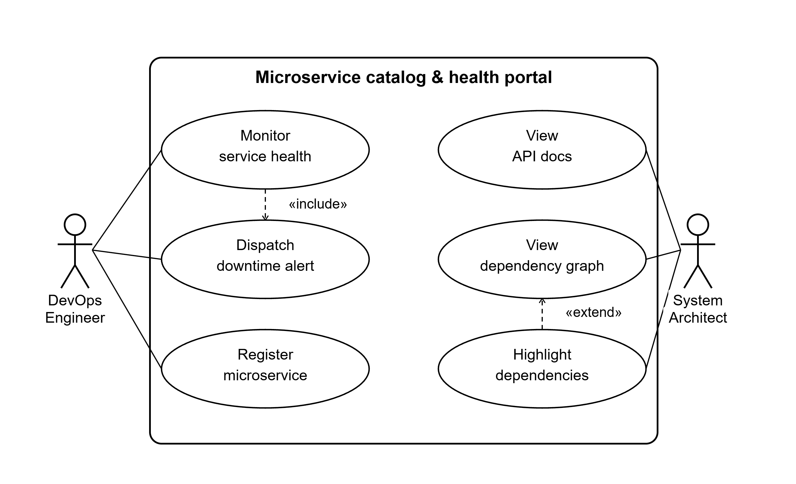

# Internal Microservice Catalog & Health Portal

**Course:** Software Engineering — Lab 1: Requirements Engineering & UML Use-Case Modelling
**Problem Statement:** #42 — Developer Tools & IT Operations

## Overview
An enterprise developer portal that maps microservice dependencies, aggregates API documentation, and runs automated periodic health-check pingers with downtime alerts.

**Target Stakeholders / Actors:** DevOps Engineer, System Architect

## Contents
- [`requirements.md`](./requirements.md) — 5 Functional Requirements (FR-001 to FR-005) and 2 Non-Functional Requirements (NFR-001, NFR-002), each with ID, priority, acceptance criteria, and rationale.
- [`usecase-diagram.png`](./usecase-diagram.png) — UML use-case diagram showing both actors, all use cases, one `<<include>>` relationship, and one `<<extend>>` relationship.
- [`usecase-flow.md`](./usecase-flow.md) — Detailed flow specification for the core use case ("Monitor Microservice Health & Dispatch Downtime Alert"), including preconditions, postconditions, main success scenario, and an alternate flow.

## Use-Case Diagram

