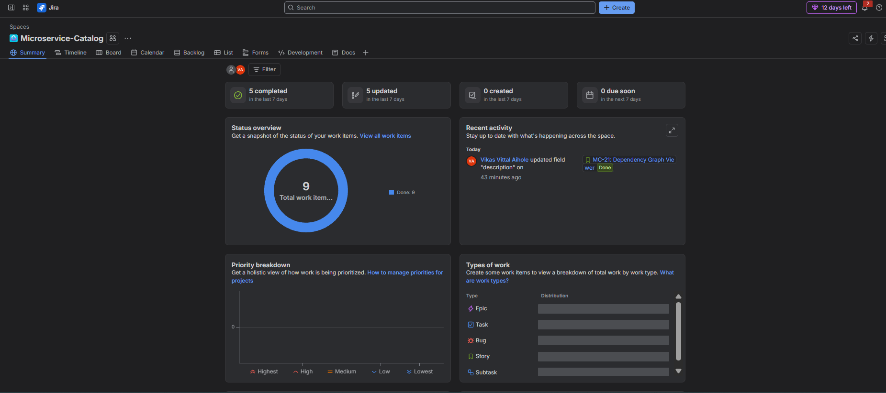
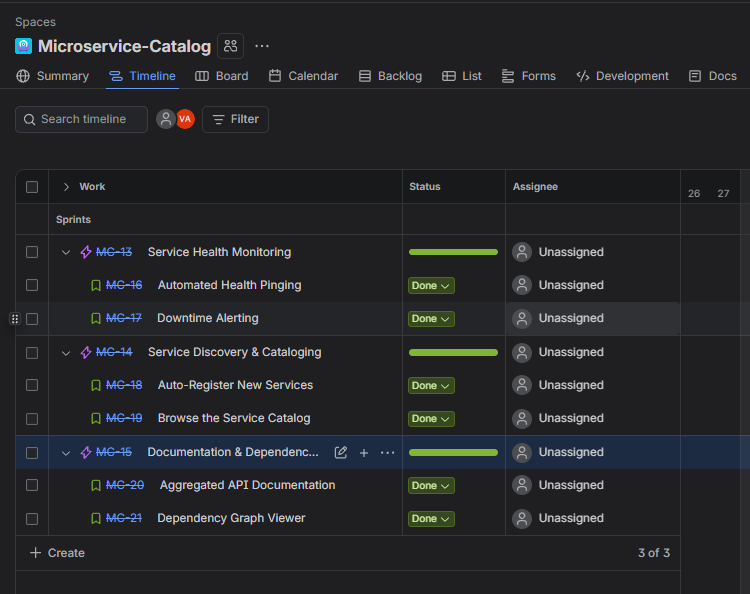
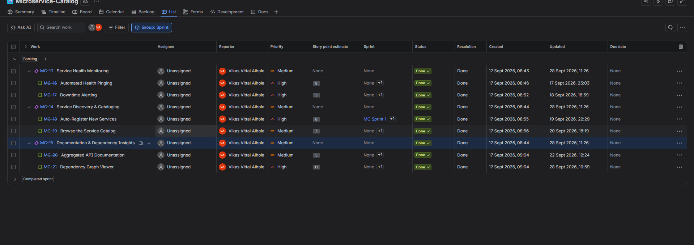
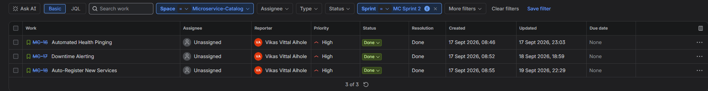
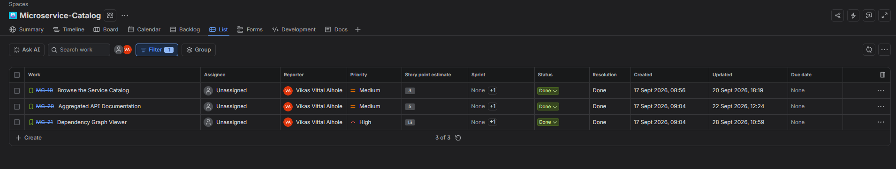
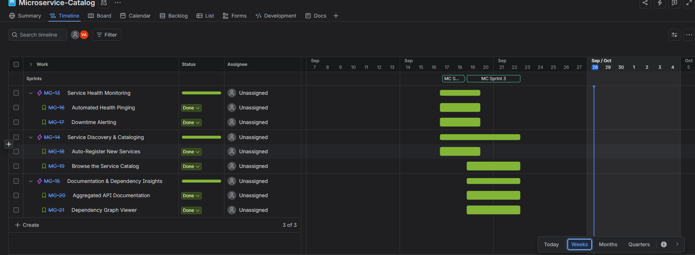

# Lab 2 — Agile Project Management with Jira

**Project:** Internal Microservice Catalog & Health Portal
**Jira Space:** Microservice-Catalog (key: `MC`)
**Course:** Software Engineering
**Author:** Vikas Vittal Aihole

---

## 1. Overview

This lab applies Agile practices to the product defined in **Lab 1** (Requirements Engineering & UML Use-Case Modelling). The Lab 1 product is an enterprise developer portal that maps microservice dependencies, aggregates API documentation, and runs automated periodic health checks with downtime alerts.

For Lab 2, the product scope was broken down in **Jira** into Epics and User Stories, estimated with story points, planned into two Sprints, and tracked to completion. The project was self-managed, so stories were not assigned to individual team members.

| Item | Count |
|------|-------|
| Epics | 3 |
| User Stories | 6 |
| Sprints | 2 |
| Total story points | 42 |
| Work items completed | 9 / 9 (100%) |

---

## 2. Actors

| Actor | Role in the system |
|-------|--------------------|
| **DevOps Engineer** | Monitors service health, receives alerts, and relies on automatic service registration. |
| **System Architect** | Browses the service catalog, reads API documentation, and analyses service dependencies. |

These are the same two actors identified in Lab 1.

---

## 3. Jira Structure

```
Microservice-Catalog (MC)
│
├── MC-13  Epic: Service Health Monitoring
│   ├── MC-16  Automated Health Pinging
│   └── MC-17  Downtime Alerting
│
├── MC-14  Epic: Service Discovery & Cataloging
│   ├── MC-18  Auto-Register New Services
│   └── MC-19  Browse the Service Catalog
│
└── MC-15  Epic: Documentation & Dependency Insights
    ├── MC-20  Aggregated API Documentation
    └── MC-21  Dependency Graph Viewer
```

---

## 4. Epics

| Key | Epic | Goal |
|-----|------|------|
| MC-13 | Service Health Monitoring | Continuously monitor microservice health and alert the team on downtime. |
| MC-14 | Service Discovery & Cataloging | Automatically detect services and give a browsable overview of what exists. |
| MC-15 | Documentation & Dependency Insights | Centralise API documentation and visualise relationships between services. |

---

## 5. User Stories

### Epic MC-13 — Service Health Monitoring

#### MC-16 — Automated Health Pinging
- **Priority:** High
- **Story points:** 8
- **User story:** As a DevOps Engineer, I want the system to automatically ping each service's health endpoint every 30 seconds, so that I always have an accurate, up-to-date view of service availability.

#### MC-17 — Downtime Alerting
- **Priority:** High
- **Story points:** 5
- **User story:** As a DevOps Engineer, I want to receive an alert when a service fails 3 consecutive health checks, so that I can respond to incidents before they impact users.

### Epic MC-14 — Service Discovery & Cataloging

#### MC-18 — Auto-Register New Services
- **Priority:** High
- **Story points:** 8
- **User story:** As a DevOps Engineer, I want newly deployed services to be automatically detected and added to the catalog, so that I don't have to manually track every deployment.

#### MC-19 — Browse the Service Catalog
- **Priority:** Medium
- **Story points:** 3
- **User story:** As a System Architect, I want to browse a list of all registered services, so that I can get a quick overview of what exists in the system.

### Epic MC-15 — Documentation & Dependency Insights

#### MC-20 — Aggregated API Documentation
- **Priority:** Medium
- **Story points:** 5
- **User story:** As a System Architect, I want to view each service's API documentation in one place, so that I don't have to dig through separate repos to understand an integration.

#### MC-21 — Dependency Graph Viewer
- **Priority:** High
- **Story points:** 13
- **User story:** As a System Architect, I want to visualize the dependencies between services in a graph, so that I can understand service relationships and identify the impact of changes or failures across the system.

---

## 6. Backlog Summary

| Key | Story | Epic | Actor | Priority | Points | Sprint | Status |
|-----|-------|------|-------|----------|--------|--------|--------|
| MC-16 | Automated Health Pinging | MC-13 | DevOps Engineer | High | 8 | Sprint 1 | Done |
| MC-17 | Downtime Alerting | MC-13 | DevOps Engineer | High | 5 | Sprint 1 | Done |
| MC-18 | Auto-Register New Services | MC-14 | DevOps Engineer | High | 8 | Sprint 1 | Done |
| MC-19 | Browse the Service Catalog | MC-14 | System Architect | Medium | 3 | Sprint 2 | Done |
| MC-20 | Aggregated API Documentation | MC-15 | System Architect | Medium | 5 | Sprint 2 | Done |
| MC-21 | Dependency Graph Viewer | MC-15 | System Architect | High | 13 | Sprint 2 | Done |

---

## 7. Sprint Planning

Each sprint contains 3 stories and 21 story points, so the workload is balanced.

### Sprint 1 — 21 points

**Dates:** 17 September 2026 – 19 September 2026
**Sprint goal:** Establish core health monitoring and give the team basic catalog visibility.

| Story | Points |
|-------|--------|
| MC-16 Automated Health Pinging | 8 |
| MC-17 Downtime Alerting | 5 |
| MC-18 Auto-Register New Services | 8 |

### Sprint 2 — 21 points

**Dates:** 19 September 2026 – 22 September 2026
**Sprint goal:** Enable automatic service registration and give architects documentation and dependency insight.

| Story | Points |
|-------|--------|
| MC-19 Browse the Service Catalog | 3 |
| MC-20 Aggregated API Documentation | 5 |
| MC-21 Dependency Graph Viewer | 13 |

> **Note on sprint names in Jira:** The sprints were created and closed in Jira under the names **MC Sprint 2** (this document's Sprint 1) and **MC Sprint 3** (this document's Sprint 2). Jira numbers sprints automatically and does not reuse earlier numbers. The screenshots therefore show the Jira names.

### Rationale for the split

- **Balanced load:** 21 points in each sprint.
- **Dependencies respected:** Alerting depends on health pinging, and the catalog, documentation and graph all depend on services being registered. Nothing in Sprint 2 is blocked by work in a later sprint.
- **Clear delivery order:** Epic 1 completes entirely in Sprint 1, Epic 3 lands entirely in Sprint 2, and Epic 2 spans both.

---

## 8. Estimation and Prioritisation

- **Estimation technique:** Story points, using a Fibonacci-style scale (3, 5, 8, 13).
- **Largest story:** MC-21 Dependency Graph Viewer (13 points), because it needs relationship data plus a graph visualisation.
- **Priority levels used:** High and Medium. Core monitoring, registration and the dependency graph are High. The catalog list and documentation aggregation are Medium.

---

## 9. Outcome

- All 6 stories are marked **Done**.
- All 3 epics were marked **Done** once every child story was complete.
- The Jira Summary page shows **9 of 9 work items Done**.
- Both sprints were completed and closed.
- Burndown charts for both sprints (Jira Sprint report, estimated in story points) are included in the screenshots section.

---

## 10. Screenshots

| # | File | What it shows |
|---|------|---------------|
| 1 | [`01-project-overview.png`](screenshots/01-project-overview.png) | Jira Summary page for the Microservice-Catalog space, with 9 of 9 items Done. |
| 2 | [`02-epics.png`](screenshots/02-epics.png) | The 3 epics (MC-13, MC-14, MC-15) with their child stories. |
| 3 | [`03-stories.png`](screenshots/03-stories.png) | All work items with priority, story point estimates and Done status. |
| 4 | [`04-sprint-1.png`](screenshots/04-sprint-1.png) | Sprint 1 contents: MC-16, MC-17, MC-18. |
| 5 | [`05-sprint-2.png`](screenshots/05-sprint-2.png) | Sprint 2 contents: MC-19, MC-20, MC-21. |
| 6 | [`06-board.png`](screenshots/06-board.png) | Timeline view showing epics, stories and both sprints. |
| 7 | [`07-burndown-sprint-1.png`](screenshots/07-burndown-sprint-1.png) | Sprint 1 burndown chart (Jira Sprint report, story points). |
| 8 | [`08-burndown-sprint-2.png`](screenshots/08-burndown-sprint-2.png) | Sprint 2 burndown chart (Jira Sprint report, story points). |

### 1. Project overview


### 2. Epics


### 3. Stories


### 4. Sprint 1


### 5. Sprint 2


### 6. Timeline / board


### 7. Sprint 1 burndown chart


### 8. Sprint 2 burndown chart


---

## 11. Repository Structure

```
SE_Microservice_Catalog/
├── Lab1/
│   ├── README.md               # Lab 1 README
│   ├── requirements.md         # Lab 1: functional and non-functional requirements
│   ├── usecase-diagram.png     # Lab 1: UML use-case diagram
│   └── usecase-flow.md         # Lab 1: use-case flow specification
│
└── Lab2/
    ├── README.md               # This file
    ├── lab2-report.pdf         # Lab 2 report
    └── screenshots/
        ├── 01-project-overview.png
        ├── 02-epics.png
        ├── 03-stories.png
        ├── 04-sprint-1.png
        ├── 05-sprint-2.png
        ├── 06-board.png
        ├── 07-burndown-sprint-1.png
        └── 08-burndown-sprint-2.png
```

---

## 12. Tools Used

- **Jira (Atlassian):** project planning, epics, stories, story points, sprints and tracking.
- **GitHub:** hosting the submission.

---

## 13. Link to Lab 1

Lab 1 (requirements and use-case modelling) is in the [`Lab1/`](../Lab1/) folder of this repository. The Jira stories in this lab trace back to those requirements and to the same two actors, the DevOps Engineer and the System Architect.
